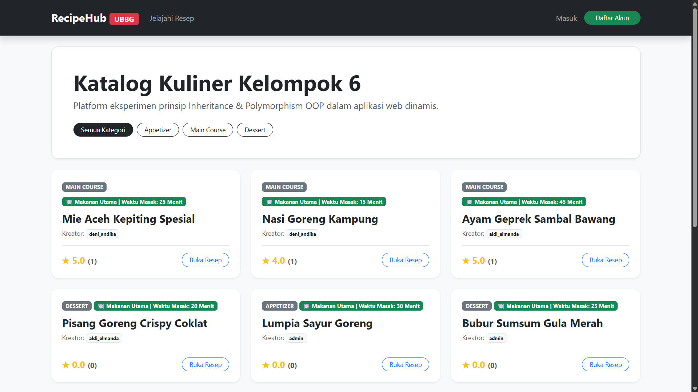
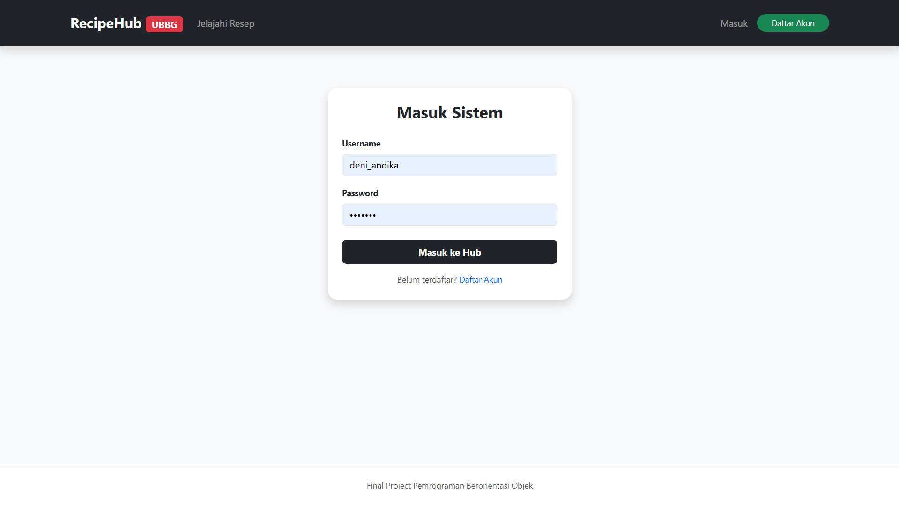
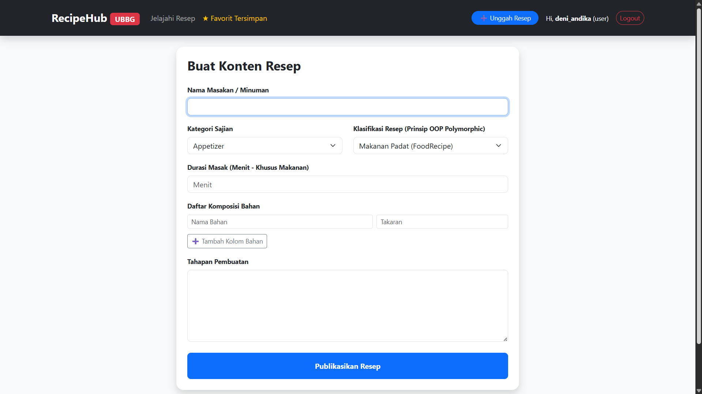
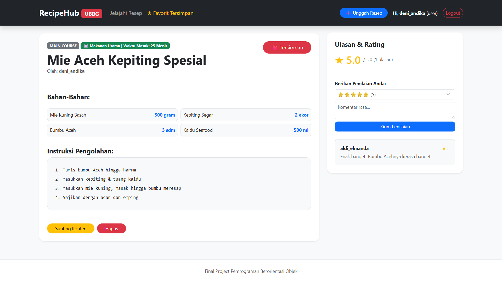
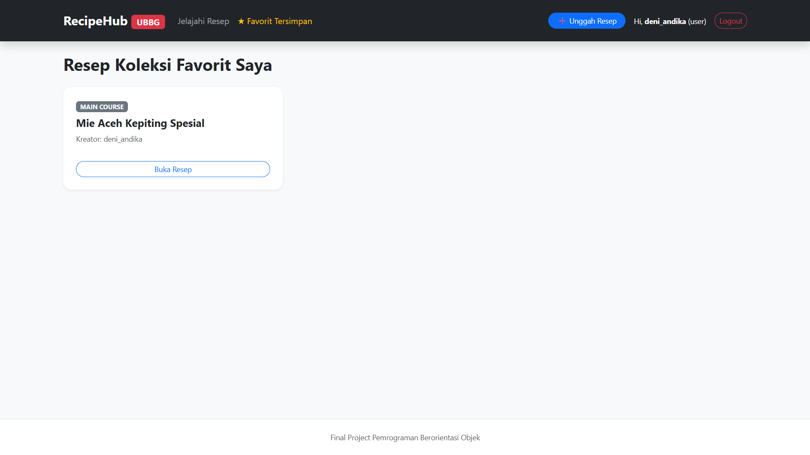
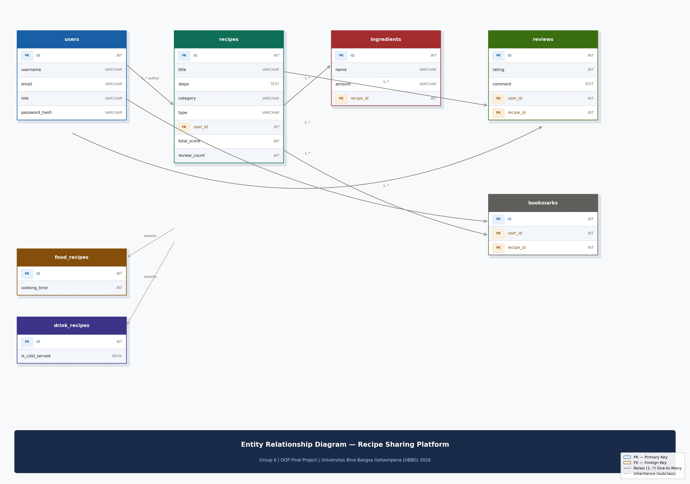

# 🍳 RecipeHub — Recipe Sharing Platform

Aplikasi web komunitas berbagi resep makanan dan minuman yang dibangun menggunakan prinsip-prinsip **Pemrograman Berorientasi Objek (OOP)** dengan Python Flask dan SQLAlchemy ORM.

## Anggota Tim

| Nama         | Username GitHub | Peran                        |
| ------------ | --------------- | ---------------------------- |
| Deni Andika  | `deni-andika`   | Ketua — Backend & OOP Models |
| Aldi Elmanda | `aldielmanda`   | Frontend & Template Jinja2   |

## Deskripsi Proyek

RecipeHub adalah platform komunitas di mana pengguna dapat:

- Memposting resep makanan (FoodRecipe) dan minuman (DrinkRecipe) beserta bahan-bahan dan langkah pembuatannya
- Memberikan rating dan ulasan terhadap resep milik pengguna lain
- Menyimpan resep favorit ke koleksi bookmark pribadi
- Menjelajahi resep berdasarkan kategori (Appetizer, Main Course, Dessert)

## Screenshots Aplikasi







## Pemenuhan Prinsip OOP

### 1. Encapsulation

- `User._password_hash` — atribut private, hanya bisa diakses via property getter/setter
- `Recipe._total_score` & `Recipe._review_count` — private, dikelola via `sync_rating()` dan `get_average_rating()`

```python
class User(db.Model):
    _password_hash = db.Column('password_hash', db.String(256))

    @property
    def password(self):
        raise AttributeError('Password terenkapsulasi secara privat!')

    @password.setter
    def password(self, pwd):
        self._password_hash = generate_password_hash(pwd)
```

### 2. Inheritance

- `FoodRecipe(Recipe)` — mewarisi semua atribut Recipe, menambah `cooking_time`
- `DrinkRecipe(Recipe)` — mewarisi semua atribut Recipe, menambah `is_cold_served`

```python
class FoodRecipe(Recipe):
    cooking_time = db.Column(db.Integer)
    __mapper_args__ = {'polymorphic_identity': 'food'}
```

### 3. Polymorphism

- Method `display_meta()` di-override berbeda di setiap subclass

```python
# Recipe (base)
def display_meta(self): return "Resep Kuliner Dasar"

# FoodRecipe
def display_meta(self): return f"🍽️ Makanan Utama | Waktu Masak: {self.cooking_time} Menit"

# DrinkRecipe
def display_meta(self): return f"🥤 Minuman Olahan | Penyajian: {'Dingin ❄️' if self.is_cold_served else 'Hangat ☕'}"
```

## Arsitektur MVC dengan Flask Blueprints

```
Project Recipe Sharing/
├── app/
│   ├── __init__.py          # Application factory (create_app)
│   ├── extensions.py        # SQLAlchemy & LoginManager instance
│   ├── config.py            # Konfigurasi aplikasi
│   ├── models/              # Model layer (M)
│   │   ├── user.py
│   │   ├── recipe.py        # Parent class
│   │   ├── food_recipe.py   # Subclass (Inheritance)
│   │   ├── drink_recipe.py  # Subclass (Inheritance)
│   │   ├── ingredient.py
│   │   ├── review.py
│   │   └── bookmark.py
│   ├── auth/                # Blueprint: autentikasi
│   │   ├── routes.py        # Controller (C)
│   │   └── forms.py
│   ├── recipes/             # Blueprint: manajemen resep
│   │   ├── routes.py        # Controller (C)
│   │   └── forms.py
│   ├── bookmarks/           # Blueprint: bookmark
│   │   └── routes.py        # Controller (C)
│   └── templates/           # View layer (V) — Jinja2
│       ├── base.html
│       ├── auth/
│       ├── recipes/
│       ├── bookmarks/
│       └── errors/
├── docs/
│   └── ERD.jpg              # Entity-Relationship Diagram
├── tests/
│   ├── test_models.py       # Unit test OOP (encapsulation, polymorphism)
│   └── test_routes.py       # Unit test semua route utama
├── seed.py                  # Data dummy untuk demo
├── run.py
└── requirements.txt
```

## Database & ERD



Database menggunakan **SQLite** dengan 5 tabel relasional:

| Tabel         | Deskripsi                                    |
| ------------- | -------------------------------------------- |
| `users`       | Akun pengguna (role: admin / user)           |
| `recipes`     | Tabel induk resep (Single Table Inheritance) |
| `ingredients` | Bahan-bahan per resep                        |
| `reviews`     | Rating dan ulasan pengguna                   |
| `bookmarks`   | Koleksi resep favorit per pengguna           |

## Technical Stack

| Komponen        | Teknologi                 |
| --------------- | ------------------------- |
| Language        | Python 3.x                |
| Framework       | Flask 3.0.2               |
| ORM             | Flask-SQLAlchemy 3.1.1    |
| Auth            | Flask-Login 0.6.3         |
| Form Validation | Flask-WTF 1.2.1 + WTForms |
| Template Engine | Jinja2                    |
| Frontend        | Bootstrap 5.3 (CDN)       |
| Database        | SQLite                    |

## Panduan Instalasi & Menjalankan Aplikasi

### Prasyarat

- Python 3.10 atau lebih baru
- pip

### Langkah Instalasi

**1. Clone repository**

```bash
git clone https://github.com/<aldielmanda>/projectrecipesharing.git
cd "Project Recipe Sharing"
```

**2. Buat virtual environment (opsional tapi disarankan)**

```bash
python -m venv venv

# Windows
venv\Scripts\activate

# Mac/Linux
source venv/bin/activate
```

**3. Install dependencies**

```bash
pip install -r requirements.txt
```

**4. Konfigurasi environment**

Buat file `.env` di root project (atau gunakan yang sudah ada):

```
SECRET_KEY=rahasia_negara_123
DATABASE_URL=sqlite:///recipe_platform.db
```

**5. Isi database dengan data dummy**

```bash
python seed.py
```

**6. Jalankan aplikasi**

```bash
python run.py
```

Buka browser dan akses: `http://127.0.0.1:5000`

## Akun Demo

| Username      | Password   | Role          |
| ------------- | ---------- | ------------- |
| `admin`       | `admin123` | Administrator |
| `deni_andika` | `deni123`  | User          |
| `aldi`        | `aldi123`  | User          |

## Fitur Utama

- **Autentikasi** — Register, Login, Logout dengan Flask-Login dan session management
- **Role-based access** — Admin dapat mengedit/menghapus semua resep, User hanya miliknya sendiri
- **Recipe CRUD** — Create, Read, Update, Delete resep beserta bahan-bahan
- **Kategori** — Filter resep berdasarkan Appetizer, Main Course, Dessert
- **Review & Rating** — Sistem ulasan dengan rata-rata skor teragregasi
- **Bookmark** — Simpan resep favorit ke koleksi pribadi
- **Polymorphic display** — FoodRecipe dan DrinkRecipe ditampilkan berbeda (cooking time vs serving style)
- **Error handling** — Custom page 404 dan 500

## Menjalankan Unit Test

```bash
python -m pytest tests/ -v
```

Test mencakup:

- Encapsulation: verifikasi private attribute password tidak bisa diakses langsung
- Polymorphism: verifikasi output `display_meta()` berbeda per subclass

## Rubrik Pemenuhan

| No  | Kriteria                 | Bobot | Status                                      |
| --- | ------------------------ | ----- | ------------------------------------------- |
| 1   | OOP Implementation       | 25%   | ✅ Encapsulation, Inheritance, Polymorphism |
| 2   | Functionality & CRUD     | 20%   | ✅ Full CRUD + validasi form                |
| 3   | Database & ORM           | 10%   | ✅ SQLite, 5 tabel, relasi FK               |
| 4   | Code Quality & MVC       | 15%   | ✅ Blueprint modular, factory pattern       |
| 5   | UI/UX & Templates        | 10%   | ✅ Bootstrap 5, Jinja2 inheritance          |
| 6   | Live Demo & Presentation | 15%   | ✅ Seed data siap, 2 role tersedia          |
| 7   | Documentation & GitHub   | 5%    | ✅ README + ERD                             |
